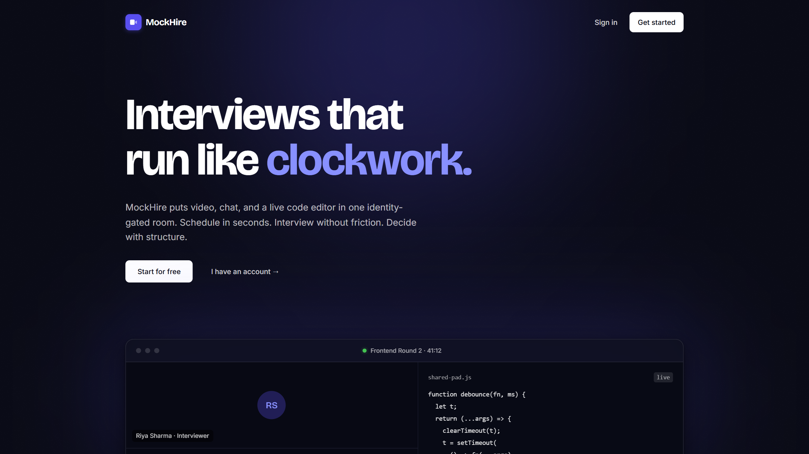
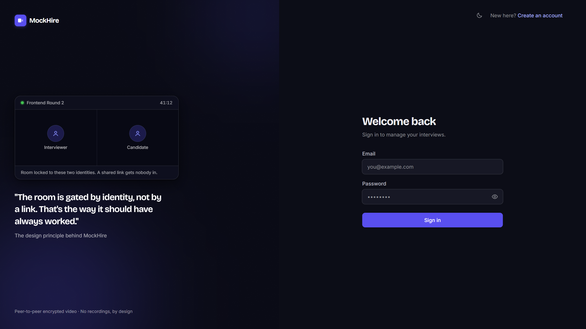
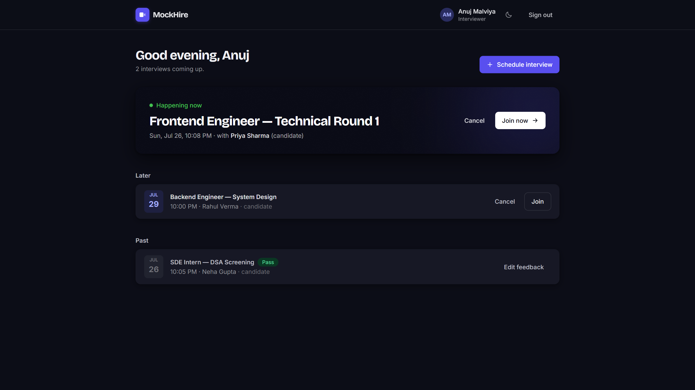
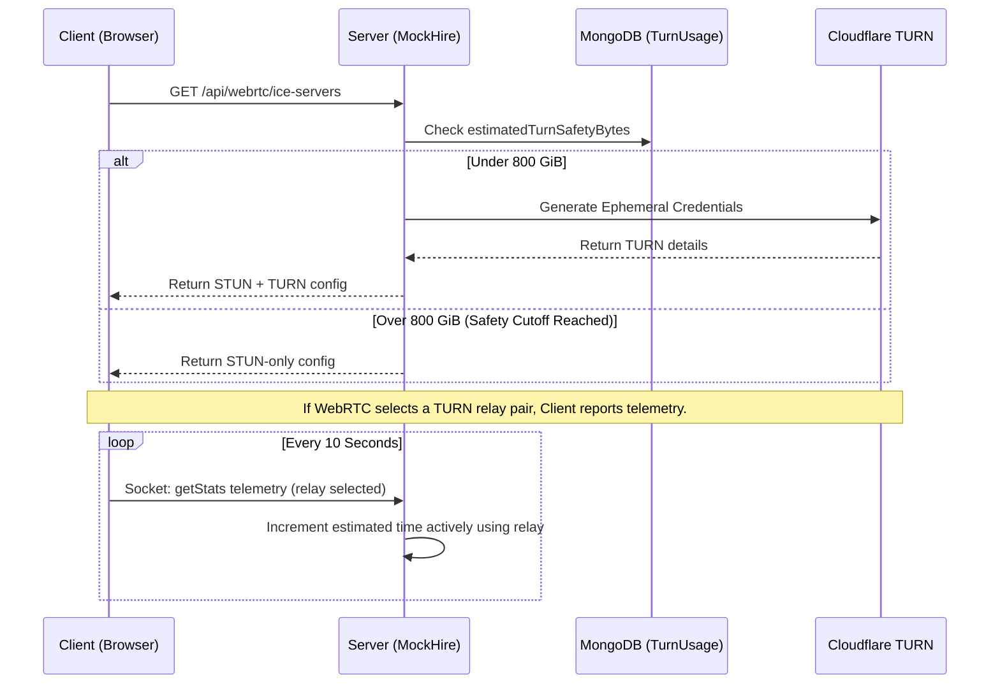

<div align="center">

# 🎥 MockHire

### Real-Time Video Interview Platform

A self-contained platform for conducting technical interviews: schedule an interview, meet the candidate over peer-to-peer WebRTC video, evaluate them in a live collaborative code editor, and record structured feedback — with security treated as a first-class requirement throughout.


</div>

Built with the MERN stack. No paid video SDKs, no third-party APIs: native WebRTC signaled over Socket.IO with a strict, self-hosted safety model.

## ✨ Core Features

- **Interviewer** — schedule interviews, join over 1:1 video with mic/camera/screen-share controls, chat, co-edit code in a shared pad, and submit structured feedback (rating, comments, pass/fail).
- **Candidate** — see upcoming and past interviews on a dashboard, join with one click, use all in-call tools, and view result status (pass/fail/pending — never the interviewer's private comments).
- **Room security** — every room code is 128 bits of cryptographic entropy (`crypto.randomBytes`); joining is authorized server-side per socket connection against the database. An outsider cannot enter a room even with the full URL. Rooms enforce an 8-hour expiry lifecycle.

## 📸 Interface

|  |  |
|---|---|
|  |  |
| Landing page | Sign in — identity-gated rooms |
|  |  |
| Interviewer dashboard | Live 1:1 call with shared code pad |

## 🏗 Architecture & WebRTC Connectivity

```mermaid
graph TD
    subgraph Browser A
        MediaA[WebRTC Media]
        SignalA[Socket.IO / REST]
    end
    
    subgraph Browser B
        MediaB[WebRTC Media]
        SignalB[Socket.IO / REST]
    end
    
    subgraph Infrastructure
        Server[Express + Socket.IO :5000]
        DB[(MongoDB)]
        STUN[Google STUN]
        TURN[Cloudflare TURN]
    end

    SignalA <-->|Auth & Signalling| Server
    SignalB <-->|Auth & Signalling| Server
    Server <-->|Persist| DB
    
    MediaA -.->|ICE Candidate Discovery| STUN
    MediaB -.->|ICE Candidate Discovery| STUN
    
    MediaA <-->|Direct P2P DTLS-SRTP <br/>(Priority 1)| MediaB
    
    MediaA -.->|Fallback Relay DTLS-SRTP <br/>(Priority 2)| TURN
    TURN -.->|Fallback Relay DTLS-SRTP <br/>(Priority 2)| MediaB

    classDef external fill:#f9f9f9,stroke:#333,stroke-dasharray: 5 5;
    class STUN,TURN external;
```

Load-bearing decisions, each argued in full in [`docs/decisions/`](docs/decisions/):

- **Video never touches the server.** Media is native WebRTC (DTLS-SRTP); the server only relays signaling (offers/answers/ICE) through authorized socket rooms. The server *cannot* see or record calls.
- **Resilient WebRTC Signaling.** Built to handle "ghost disconnects" and sudden page refreshes seamlessly. Strict cleanup flows ensure peers can drop and reconnect without breaking perfect negotiation state.
- **One HTTP server for REST and sockets.** The WebSocket handshake authenticates with the same httpOnly cookie as REST; no second auth scheme, no token in JavaScript.
- **Bind first, connect second.** The API binds its port immediately and connects to MongoDB in the background with backoff retry, solving cold-start latency.
- **Role is never read from the JWT.** Every request re-reads the user from the DB; logout bumps a `tokenVersion` that invalidates every previously issued token.

## 🛡️ TURN Safety Model

To solve cross-network connectivity (e.g., Cellular to Cellular across restrictive symmetric NATs), MockHire implements Cloudflare TURN as an ICE fallback relay. However, to eliminate the risk of unbounded provider overage, it enforces a strict application-level safety model:



- **Ephemeral Credentials:** Permanent provider secrets never leave the server. Clients receive short-lived credentials bounded by the room's 8-hour expiry.
- **Conservative Accounting:** The server accumulates `estimatedTurnSafetyBytes` internally by multiplying active relay time by a conservative maximum bandwidth ceiling.
- **Hard 800 GiB Cutoff:** If the estimate crosses 800 GiB in a given month, the server stops issuing TURN credentials. 
- **Graceful Drain:** Existing TURN-backed media sessions are notified and drained after 60 seconds, gracefully falling back to STUN-only without disconnecting the room infrastructure (chat, pad, signaling). Direct P2P calls remain unaffected.

## 🔐 Security & Engineering Highlights

Security requirements were specified in the PRD before the first line of code and tracked against [`docs/SECURITY-CHECKLIST.md`](docs/SECURITY-CHECKLIST.md) at every milestone.

| Threat | Control |
|---|---|
| Password theft | bcrypt cost 12; hash `select:false` |
| Token theft via XSS | JWT in an **httpOnly** cookie — unreadable by JavaScript |
| CSRF | `SameSite=Lax` + strict single-origin deployment |
| Brute force / Abuse | 20 req/15 min on auth routes; 300 req/15 min general API limit; Socket bucket limits |
| NoSQL injection | `express-mongo-sanitize` + Mongoose `strictQuery` |
| Room gate-crashing | 128-bit random codes; socket-level DB authorization per join |
| IDOR | Every interview query strictly scoped to the authenticated user's ID |
| XSS via chat/code | Length caps + React text-node rendering; no `dangerouslySetInnerHTML` |
| Header attacks | Helmet with strict CSP in production, `x-powered-by` removed |
| TURN Abuse | Ephemeral credentials + 800 GiB cutoff + 60s active room drain |

## 🧪 Testing

The repository maintains an exhaustive 154-assertion integration test suite.

```bash
cd server
npm run dev            # tests exercise the live API — start it first
node tests/m2-interviews.test.mjs
node tests/m3-signaling.test.mjs
node tests/stage5-cutoff.test.js
```

The suites run against a real server and a real database (self-cleaning: they delete every document they create). They test the integration layer (cookie flows, socket handshakes, authorization, rate limits, and TURN cutoff states) rather than mocked units.

## 📁 Project Structure

```
client/           React 18 app (Vite + Tailwind v4)
  src/pages/      Landing, Login, Register, Dashboard, InterviewRoom
  src/components/ UI primitives, room panels, auth layout
  src/lib/        api.js (fetch wrapper), rtc.js, socket.js
server/           Express + Socket.IO backend
  src/routes/     auth.js, interviews.js, webrtc.js
  src/socket/     signaling, chat, code sync, telemetry
  src/services/   turnAccounting.js, turnBudget.js
  src/models/     User, Interview, TurnUsage
  tests/          integration suites
docs/             Architecture guide, PRD, per-milestone decision records
```

## 🚀 Environment Setup & Local Development

Prerequisites: **Node.js ≥ 20** and a MongoDB instance (local `mongod` or [MongoDB Atlas](https://www.mongodb.com/atlas)).

```bash
git clone https://github.com/AnujMalviya2154/Video-Interview-Platform.git
cd Video-Interview-Platform

# 1. Server
cd server
npm install
cp .env.example .env    # then edit .env — see below
npm run dev             # API + signaling on http://localhost:5000

# 2. Client (second terminal)
cd client
npm install
npm run dev             # app on http://localhost:5173
```

Configure `server/.env` (never committed — `.gitignore`d from the first commit). The server refuses to start with a missing or short `JWT_SECRET`.

| Variable | What to set |
|---|---|
| `PORT` | API port (default `5000`) |
| `MONGO_URI` | Your MongoDB connection string |
| `JWT_SECRET` | ≥ 32 chars. Generate: `node -e "console.log(require('crypto').randomBytes(64).toString('hex'))"` |
| `CLIENT_ORIGIN` | Client URL for CORS (default `http://localhost:5173`) |
| `NODE_ENV` | `development` or `production` |
| `TURN_KEY_ID` | (Optional) Cloudflare Realtime API Key ID for TURN fallback |
| `TURN_KEY_API_TOKEN` | (Optional) Cloudflare Realtime API Token for TURN fallback |

## 🚢 Deployment

Production is a single origin: build the client and the server serves it — static assets, SPA deep links, REST, and websockets all on one port, keeping the `SameSite=Lax` cookie effective.

```bash
cd client && npm run build
cd ../server
NODE_ENV=production node src/index.js
# Serves application and API on http://localhost:5000
```

In production, the server enforces a strict Content-Security-Policy (computed against the built `index.html` at boot), serves hashed assets with immutable caching, and disables dev request logging.

## 📖 Documentation

Start reading here to understand the codebase:
1. `docs/ARCHITECTURE.md` — The system shape and backend overview.
2. `docs/PRD.md` — What was built and why.
3. `docs/decisions/` — Read the per-milestone ADRs to understand every engineering choice and the alternatives that lost. 

## 🗺️ Future Work

See [`docs/FUTURE-SCOPE.md`](docs/FUTURE-SCOPE.md) for planned platform hardening, multi-participant room considerations, and provider-authoritative reconciliation strategies.

---

**Author:** Anuj Malviya — [github.com/AnujMalviya2154](https://github.com/AnujMalviya2154)
